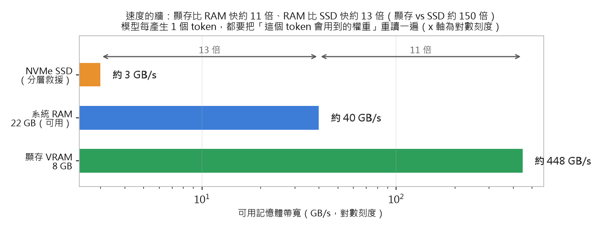
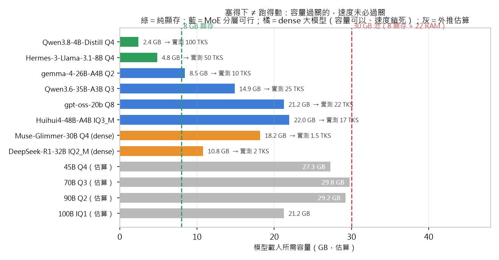
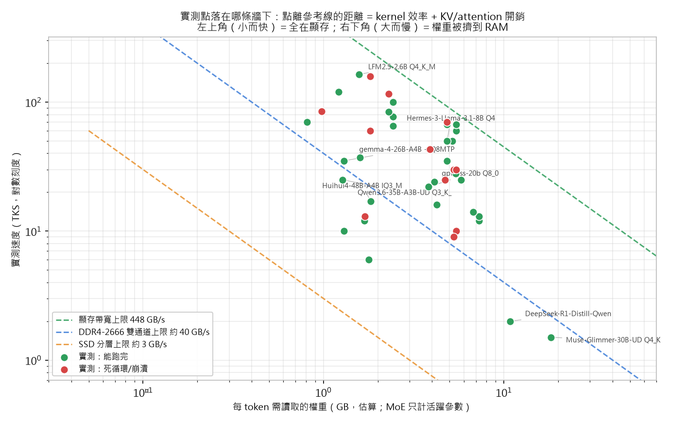
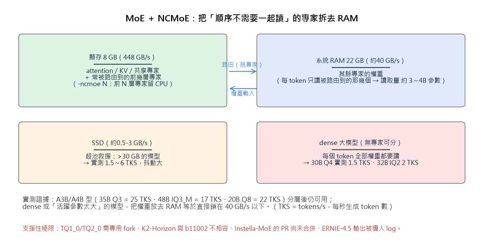
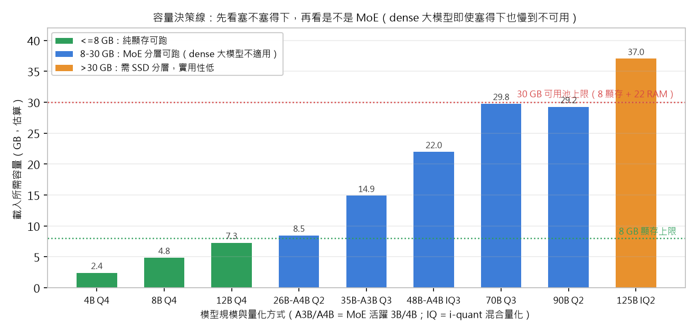
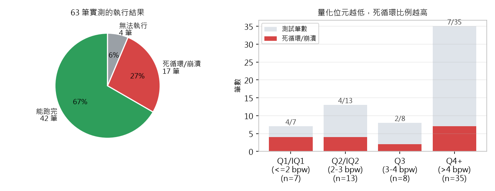

# 3060 Ti 8G ＋ 32G DDR4-2666 本機 LLM 實測報告（v2）

<a id="top"></a>

> 🌐 **語言／Language：中文（本文）** ｜ [**English Summary ↓**](#english-summary)
> 🧭 **快連**：[0 TL;DR](#0-三分鐘版tldr) ｜ [1 硬體天花板](#1-硬體基線天花板在哪為什麼) ｜ [**1.4 NCMoE 與三個極限**](#ncmoe) ｜ [2 核心結論](#2-核心結論原報告結論重整補充) ｜ [3 實測總表 63 筆](#3-實測總表63-筆原始數據) ｜ [4 評分榜](#4-gpt-sol-基準評分榜沿用原報告) ｜ [5 選型梯隊](#5-參數梯隊選型指南8gb-vram--32gb-ram) ｜ [6 死循環對策](#6-死循環無限迴圈診斷與六種對策) ｜ [7 起始參數](#7-本機建議起始參數4096-ctx--8-gb-vram) ｜ [8 決策樹](#8-決策樹依任務挑模型) ｜ [9 GGUFRun](#9-用-ggufrun-跑這份清單) ｜ [附錄 A](#附錄-a相容性與已知問題) ｜ [B 連結核對](#附錄-b連結核對狀態) ｜ [C 修正紀錄](#附錄-c本次優化修正紀錄) ｜ [D English](#english-summary)

> **硬體**：NVIDIA RTX 3060 Ti（8 GB GDDR6，448 GB/s）＋ 32 GB DDR4-**2666** ＋ Windows 11
> **測試條件**：Context **4096**、**Q4KV**、單次任務「撰寫 1,000 字推理小說」，滿載 63 顆模型／量化檔
> **評分基準**：GPT-SOL 標準（6.0 / 10 為及格線）
> **本檔來源**：由 `llm_evaluation_4096_q4kv_report.md`（2026-09-18，作者原始紀錄）優化而成。
> **原始實測數據一字未改**；新增的是分析、修正、決策樹與工具操作章節，修正項目見 [附錄 C](#附錄-c本次優化修正紀錄)。

---

## 0. 三分鐘版（TL;DR）

1. **這台機器是「帶寬受限」不是「算力受限」。** GPU 的算力（約 16 TFLOPS FP16）幾乎沒被餵飽，真正的牆是
   **顯存 8 GB（448 GB/s）** 與 **DDR4-2666 雙通道（實務約 35～40 GB/s）之間的 10 倍落差**。
   模型每產生一個 token 就要讀一遍「這個 token 會用到的權重」——**讀得動就快，讀不動就等**。
2. **可用記憶體是一個 30 GB 的池＝顯存 8 GB ＋ RAM 約 22 GB，但兩層速度差 11 倍。**
   所以「大模型能不能用」的真正問題是「**能不能只讓活躍權重被讀**」＝ **MoE ＋ `-ncmoe` 分層**：
   A3B/A4B 型實測可到 **35B Q3（25 TKS）**、48B IQ3_M（17 TKS）、20B Q8（22 TKS）；
   **dense 模型沒有這個槓桿**（30B Q4 只剩 1.5 TKS）。再往上（45B Q4／70B Q3／90B+）
   即使勉強塞進 30 GB，也只會落在 1.5～6 TKS 或根本載不起來 → 見 1.4 節的三個極限。
3. **品質天花板**：本機 63 筆中唯一被評為「最像樣」的是 **`gemma-4-26B-A4B-it-UD-Q2_K_XL`（＋Q8MTP, n_max=1）**；
   快而穩的是 **`Gemma-4-E4B-Uncensored-…-Q4_K_P`（77 TKS，寫滿字數不崩，但內容空洞）**。
4. **最大的失敗模式是「死循環」：63 筆中有 17 筆（27%）**，且幾乎集中在
   **極低量化（Q1/Q2/IQ1/IQ2）＋ 長輸出（>1,000 字）＋ 非中文主語料或被剪枝的模型**。
   它多半是**參數與流程問題，不是模型沒救** → 見 [第 6 節六種對策](#6-死循環無限迴圈診斷與六種對策)。
5. **工具**：這份清單裡所有「跑得動 / 跑不動」的差別，用 **[GGUFRun](https://github.com/BBQ2077/GGUFRun)**
   一個視窗就能掃完（`-ncmoe` 滑桿、KV 量化、投機解碼、DRY、每顆模型綁一套參數）→ 見 [第 9 節](#9-用-ggufrun-跑這份清單)。

---

## 1. 硬體基線：天花板在哪、為什麼

### 1.1 兩個不同的瓶頸

| 瓶頸 | 決定什麼 | 這台機器的數字 |
| :--- | :--- | :--- |
| **容量**（顯存 8 GB / 記憶體 32 GB） | 模型**能不能載入** | 純 GPU 約 ≤ 12B Q4；8G＋32G 混合約 ≤ 35B Q3（MoE） |
| **帶寬**（448 GB/s vs 約 35～40 GB/s） | 載入後**跑多快** | 純 GPU 約 6～8 倍於 CPU/RAM 的速度 |
| （算力 ~16 TFLOPS FP16） | 幾乎不是瓶頸 | 在本機選型中可以直接忽略 |

### 1.2 帶寬算式與實測對照（一致性檢查）

推理速度的粗略上限：

```
t/s 上限 ≈ 可用帶寬 ÷ 每 token 需讀取的權重位元組
（MoE 只算「活躍專家」；權重從 VRAM 讀＝448 GB/s，從 RAM 讀＝約 35～40 GB/s）
```

| 模型（本報告實測） | 每 token 需讀（估算） | 主要來源 | 上限估算 | **實測** | 效率 |
| :--- | :--- | :--- | :--- | :--- | :--- |
| 8～9B Q4_K（如 Gemma-4-E4B、Qwen3.8-9B） | 約 5 GB | VRAM 448 GB/s | 約 90 t/s | **60～77 TKS** | 67～85% |
| 2.6～3B Q4_K（LFM2.5、Ling、Nanbeige） | 約 1.8 GB | VRAM 448 GB/s | 約 240 t/s | **158～164 TKS** | 67～68% |
| Qwen3.6-35B-A3B Q3_K_XL（MoE, A3B） | 約 1.3 GB（活躍） | **RAM 約 40 GB/s** | 約 30 t/s | **25 TKS** | 約 83% |
| gemma-4-26B-A4B Q2_K_XL（MoE, A4B） | 約 1.5 GB（活躍） | 混合（部分 VRAM） | 10～35 t/s | **10 TKS（思考 5）** | 視層分佈 |
| DeepSeek-R1-Distill-32B IQ2_M（dense） | 約 9.5 GB | **RAM 約 40 GB/s** | 約 4 t/s | **2 TKS** | 交換中 |
| Muse-Glimmer-30B Q4_K_XL（dense） | 約 18 GB | RAM／SSD | 約 2 t/s | **1.5 TKS** | SSD 分頁 |
| Ternary-Bonsai-2-27B PTQ1_0（1-bit dense） | 約 5.9 GB | VRAM／部分卸載 | 理論約 76 t/s | **28 TKS** | 偏低（1-bit 核心效率差） |

**讀法**：
- 實測與帶寬上限**大體相符**（效率 67～85%），代表這份數據是可信的。
- **只要模型的每 token 權重讀取來源是 RAM，速度就被鎖在 30 t/s 以下**——這就是為什麼「參數大 ≠ 好用」。
- **MoE 的槓桿**：`A3B` 的活躍參數只有 3B。把**活躍專家留在顯存**、把冷門專家丟到 RAM，
  就能同時拿到「大模型的知識廣度」和「小模型的讀取量」。這是 8G 顯存唯一實質的破局手段。
- Ternary-Bonsai 的效率明顯低於理論值 → 符合「1-bit 權重的 CUDA 核心效率不佳 ＋ 部分層沒進顯存」的解釋。

### 1.3 記憶體預算：可用的是一個 30 GB 的池（顯存 8 GB ＋ RAM 約 22 GB）

> **更正說明**：本報告初版把原報告的「30GB」判成算術錯誤——那是**我誤讀**。原報告的算式是
> **8 GB 顯存 ＋ 32 GB RAM − 系統 10 GB ＝ 30 GB**，把顯存一起算進同一個池，寫法是合理的。
> 這裡正式更正，並把這個池拆成「兩個速度不同的層」來看。

| 層 | 可用容量 | 帶寬 | 放什麼 |
| :--- | :--- | :--- | :--- |
| 顯存 VRAM | 8 GB（扣掉桌面/顯示後實際約 7.4～7.8 GB） | **448 GB/s** | attention、KV cache、共享專家、常被路由到的專家層 |
| 系統 RAM | 約 22 GB（32 − Windows／背景 8～12 GB） | **約 35～40 GB/s** | 其餘專家的權重（MoE）、被卸載的 dense 層 |
| **合計** | **約 30 GB** | — | 這就是「這台機器能載入多大的模型」的依據 |



**關鍵在於：這 30 GB 不是一個均勻的池。** 權重只要從顯存掉到 RAM，每讀 1 GB 的代價就多 11 倍
（掉到 SSD 更是 150 倍）。所以「**塞得下**」與「**跑得動**」是兩個獨立的關卡：



原報告「45B Q4／70B Q3／90～100B Q1-Q2 有機會」的說法，**必須補上「僅限 MoE 型、且要靠 NCMoE 分層」這個前提才成立**；把它套用在 dense 模型上就會得到與實測相反的結論。逐條對照：

| 原報告說法 | 結合 NCMoE 之後的正確結論（依實測） |
| :--- | :--- |
| 可跑 **45B Q4**（約 27 GB） | 只有 **MoE 型（活躍 ≲ 5B）** 值得試，且 27 GB 已卡在 30 GB 上緣、幾乎沒有 KV/context 空間 → **極限區**；**dense 45B Q4 不可行**（每 token 全權重讀 → 個位數 TKS） |
| 可跑 **70B Q3**（約 30 GB） | 正好卡死池的上限，KV/context 沒有空間；要跑只能借 SSD，而該區間實測只有 **1.5～6 TKS** → **不實用** |
| Q1/Q2 可上探 **90～100B** | 容量上（IQ1 約 21 GB）塞得進，但**實測 125B UltraLite-37GiB 只有 6 TKS、且中英文都無法正常回應** → **能載入 ≠ 能用**；此類模型多半還需要客製分支才載得起來 |
| — | **實測可行上限：MoE（A3B/A4B）35B Q3 ＝ 25 TKS、48B IQ3_M ＝ 17 TKS、20B Q8 ＝ 22 TKS**；純 dense ≤ 12B Q4（13～84 TKS） |

### 1.4 破局手段只有一個：MoE ＋ NCMoE 分層（與它的三個極限）

<a id="ncmoe"></a>

`-ncmoe N`（llama.cpp 的 `--n-cpu-moe`）把**前 N 層的專家權重留在 CPU／RAM**，其餘留在顯存；
`-ncffn N` 對 dense FFN 做同樣的事。MoE 每個 token 只會路由到少數專家，
因此「每 token 需讀取的權重 ≈ **活躍參數**」而不是全部參數——這是 8 GB 顯存唯一能吃下 30B 以上模型的機制。





**實測證據（分層後仍然可用）**：

| 模型 | 總參數／活躍 | 量化 | 載入約 | 實測 |
| :--- | :--- | :--- | :--- | :--- |
| `gpt-oss-20b` | 20B / 3.6B | Q8_0 | 21.2 GB | **22 TKS** |
| `Qwen3.6-35B-A3B` | 35B / 3B | Q3_K_XL | 14.9 GB | **25 TKS** |
| `Huihui4-48B-A4B` | 48B / 4B | IQ3_M | 22.0 GB | **17 TKS** |
| `gemma-4-26B-A4B` | 26B / 4B | Q2_K_XL | 8.5 GB | 10 TKS（＋Q8MTP 時 **35 TKS**） |
| `Nemotron-3-Nano 30B-A3B` | 30B / 3B | Q4_0 | 17 GB | 12 TKS |

**三個極限——這就是「部分模型也難支援」的原因**：

| 極限 | 機制 | 實測反例 |
| :--- | :--- | :--- |
| **① 池的硬上限 30 GB** | 45B Q4／70B Q3 幾乎不留 KV/context 空間，再上去只能借 SSD | `70B Q3` ≈ 29.8 GB → 只剩約 0.2 GB 給 KV 與 context |
| **② 模型類型：dense 沒有專家可分** | dense 每個 token 都要讀全部權重 → 速度直接鎖在 RAM 帶寬以下 | `Muse-Glimmer-30B Q4` ＝ **1.5 TKS**、`DeepSeek-R1-32B IQ2_M` ＝ **2 TKS**（容量其實塞得下） |
| **③ 格式／架構支援性** | 不是「慢」而是「載不起來」或「跑起來是壞的」 | `TQ1_0/TQ2_0` 需專用 fork；`K2-Horizon-7B` 與 llama-b11002 CUDA 不相容；`amd.Instella-MoE` 的 PR 尚未合併；`ERNIE-4.5` 輸出被導入 log；`Qwen3.8-Flash-Next-125B` 需自行編譯且輸出無效 |



**操作要點**：NCMoE 的甜蜜點要用**掃的**，不要用猜的——`-ncmoe` 太小＝顯存爆掉載不進去，
太大＝專家全留在 RAM、速度掉到 10 TKS 以下。GGUFRun 有現成的掃描工具與滑桿（見第 9 節）。

### 1.5 今天就能做的三個硬體向優化（零成本）

1. **確認記憶體跑在雙通道**（工作管理員 → 效能 → 記憶體 → 「通道」應顯示 2）。
   插成單通道會讓 RAM 帶寬直接砍半（約 21 GB/s），所有 MoE 卸載型模型的速度跟著砍半。
2. **模型檔放 NVMe，且同步關掉吃 RAM 的軟體**（瀏覽器分頁是最大宗）。
   實測中 32B IQ2_M 掉到 2 TKS 就是「RAM 不夠 → 分頁到磁碟」的典型後果。
3. **不要把 `-c`（context）開到用不到的大小**。4096 的任務就給 4096；
   開 65536 只是白白吃掉 KV 空間（尤其 KV 量化後仍有成本），並放大長文重複傾向。

---

## 2. 核心結論（原報告結論重整＋補充）

### 2.1 陣營特性（沿用原報告，並用實測數據補強）

| 陣營 | 文字能力 | 邏輯約束 | 實測證據 |
| :--- | :--- | :--- | :--- |
| **Gemma 系列** | 奔放、詞藻生動 | 弱，注意力易發散 | 品質最高的 `gemma-4-26B-A4B Q2_K_XL` 出自此系；但 `gemma-4-12b-it-UD-Q2_K_XL`、`E4B-it-OBLITERATED` 後半段邏輯崩潰 |
| **Qwen 系列** | 中規中矩～酷炫 | 較強、結構完整 | `Qwen3.6-35B-A3B Q3_K_XL`（25 TKS）無死循環；`Qwen3-8B` 官方版邏輯型但篇幅短 |
| **DeepSeek 蒸餾／Coder** | 前半段強、後段發散 | 中 | `DeepSeek-R1-0528-8B` 前半優秀、後段無結局；`Coder-V2-Lite IQ2` 結構混亂 |
| **小模型（≤4B）** | 工具型，創意低 | 快但淺 | `MiniCPM5-2B` 120 TKS、`LFM2.5-2.6B` 164 TKS，但都無法寫作 |

### 2.2 選型結論（8 GB VRAM ＋ 32 GB RAM）

- **純顯存（免折騰）極限**：約 12B Q4（約 6.7 GB VRAM）。
- **免折騰首選（原報告）**：`Ternary-Bonsai-2-27B`（PTQ1_0，約 5.9 GB）——**但需要專用 fork 與指定參數**；
  本報告補充：它的長文在 **2,000～3,000 字**處崩潰，且 GPT-SOL 分數浮動極大（2.2～5.1），
  屬「能塞進 8G 顯存的展示品」，不是長文工作方案。
- **剪枝警示（原報告，實測完全支持）**：REAP-320 系列**英文正常、中文陷入無限迴圈**，
  剪枝破壞了中文語料分佈。**看到 `reap`、`REAP320` 等字樣的社群量化版，中文寫作要打折看待。**
- **本報告新增結論**：
  1. **投機解碼（MTP／dspark／dflash 草稿模型）在 8G 顯存上值得開**：`gemma-4-26B-A4B Q2_K_XL + Q8MTP(n_max=1)`
     從 10 TKS 提升到 **35 TKS**（同一顆模型）。
  2. **同一顆模型「降一級量化」是消除死循環最快的手段**（例：`gemma-4-12b-it` Q2_K 死循環 → Q4_K_XL 能跑完）。
  3. **1,000 字與 3,000 字是兩個完全不同的任務**：本機幾乎沒有模型能穩定輸出 3,000 字，
     超過 1,000 字就該改用「大綱 → 分段」流程（見第 8 節）。
  4. **大模型能不能用，一律先問「是不是 MoE、能不能用 `-ncmoe` 分層」**（詳見 1.3／1.4 節）：
     容量關過得了、速度關未必過得了；dense 大模型即使塞得下也只有 1.5～2 TKS。

---

## 3. 實測總表（63 筆，原始數據）



**一句話讀圖**：41 筆（65%）能跑完、17 筆（27%）死循環／崩潰、5 筆根本無法執行；
**量化位元越低，死循環比例越高**——Q1/IQ1 區間幾乎全滅，Q4 以上才穩定。

### 3.1 主表（48 筆）

| 模型名稱 / 檔案名稱 | 核心測試評價與特徵反饋 | 推理速度 (TKS) | 參考連結 (Hugging Face / 專案) |
| :--- | :--- | :---: | :--- |
| **Gemma-4-E4B-Uncensored-HauhauCS-Aggressive-Q4_K_P** | 詞藻華麗但缺乏實質內容；寫滿字數不崩潰、無無限死循環。 | 77 TKS | [HauhauCS/Gemma-4-E4B-Uncensored](https://huggingface.co/HauhauCS/Gemma-4-E4B-Uncensored-HauhauCS-Aggressive) |
| **Bonsai-27b-1bit-CRACK-Q1_0** | 極差，中英混雜嚴重，頻繁陷入無限循環，幾乎無法使用。 | - | ⚠️ 第三方再發布（不提供連結；建議刪除） |
| **Bonsai-27B-Q1_0 (官方版)** | 表現同破解版，中英混雜且無限循環。 | - | [prism-ml/Ternary-Bonsai-2-27B](https://huggingface.co/prism-ml/Ternary-Bonsai-2-27B-gguf) |
| **Bonsai-27B-dspark-dflash-Q4_0** | 0.6G DF 配置，運行速度顯著下降。 | 慢速 | [prism-ml/Ternary-Bonsai-2-27B](https://huggingface.co/prism-ml/Ternary-Bonsai-2-27B-gguf) |
| **Huihui-MiniCPM5-2B-abliterated-GGUF** | 體積極小且速度飛快，但創意性極低，定位偏向數理小工具模型。 | 120 TKS | [huihui-ai/MiniCPM5-2B-abliterated](https://huggingface.co/huihui-ai/Huihui-MiniCPM5-2B-abliterated) |
| **Huihui-Spark-X2.5-4B-abliterated-Q4_K_M** | 帶有 Gemma 系列風格，在此參數級別表現尚可，超越同級小鋼炮。 | 100 TKS | [huihui-ai/Spark-X2.5-4B-abliterated](https://huggingface.co/huihui-ai/Huihui-Spark-X2.5-4B-abliterated) |
| **K2-Horizon-7B-Q4_K_M.gguf** | 與當前 llama-b11002-bin-win-cuda 環境不相容，無法執行。 | - | [IFM/K2-Horizon-7B](https://huggingface.co/IFM/K2-Horizon-7B) |
| **Ornith-1.5-9B-GGUF** | 介於普通作文與拙劣之間，表現微妙。 | 60 TKS | [mradermacher/Ornith-1.5-9B-uncensored](https://huggingface.co/mradermacher/Ornith-1.5-9B-uncensored-GGUF) |
| **Qwen3.8-4B-Distill-GGUF** | 優於 Gemma-4-E4B，呈現初階作者筆觸。 | 100 TKS | [empero-ai/Qwen3.8-4B-Distill](https://huggingface.co/empero-ai/Qwen3.8-4B-Distill-GGUF) |
| **maple-preview-TQ1_0-head-Q4_K** | 文筆優秀，比 Qwen3.8-4B 好，但故事結構欠佳（長文無大綱），3000 字後邏輯渙散但無單句死循環。 | 38 TKS | [deepgrove/maple-preview](https://huggingface.co/deepgrove/maple-preview) |
| **gemma4-v2-Q3_K_M-yuxinlu1** | 量化過度導致崩潰，陷入無限迴圈。 | - | [yuxinlu1/gemma-4-12B-agentic-v2](https://huggingface.co/yuxinlu1/gemma-4-12B-agentic-fable5-composer2.5-v2-3.5x-tau2-GGUF) |
| **Huihui-Qwen3-8B-abliterated-v2-Q4_K_M-GGUF** | 虎頭蛇尾，篇幅拉長即出現死循環。 | 70 TKS | [huihui-ai/Qwen3-8B-abliterated](https://huggingface.co/huihui-ai/Huihui-Qwen3.8-27B-abliterated-GGUF) |
| **Qwen3.8-27B RVN Heretic Abliterated-IQ1_S** | 觸發無限迴圈後自動中斷。 | 30 TKS | [Qwen/Qwen3.8-27B](https://huggingface.co/Qwen/Qwen3.8-27B) |
| **Qwen3.8-9B-Q4_K_M.gguf** | 行文風格酷炫但完全缺乏邏輯內核；但能完整寫完不卡死。 | 67 TKS | [empero-ai/Qwen3.8-9B-Distill](https://huggingface.co/empero-ai/Qwen3.8-9B-Distill-GGUF) |
| **Ling-3.0-tiny-Q4_K_M.gguf** | 陷入無限迴圈。 | 158 TKS | [inclusionAI/Ling-3.0-tiny](https://huggingface.co/inclusionAI/Ling-3.0-tiny) |
| **LFM2.5-2.6B-Q4_K_M.gguf** | 劇情尚可，但強制挪用給定開頭且人物隨機更換，穩定性差。 | 164 TKS | [LiquidAI/LFM2.5-2.6B](https://huggingface.co/LiquidAI/LFM2.5-2.6B) |
| **Phi-4-mini-instruct-Q4_K_M.gguf** | 容易無限循環；偶爾生成但離題且品質低劣。 | 116 TKS | [microsoft/Phi-3-mini-4k-instruct](https://huggingface.co/microsoft/Phi-3-mini-4k-instruct) |
| **Qwen3.6-14B-A3B-FableVibes-Q2_K.gguf** | 無限死循環，且非預期切換為英文。 | 85 TKS | [tvall43/Qwen3.6-14B-A3B-FableVibes](https://huggingface.co/tvall43/Qwen3.6-14B-A3B-FableVibes-GGUF) |
| **Qwen3-8B-Q4_K_M.gguf (官方版)** | 故事僅寫 600 字開頭；要求 3000 字時直接回覆超出能力上限。 | 70 TKS | [Qwen/Qwen3-8B](https://huggingface.co/Qwen/Qwen3-8B) |
| **OxCoder-9B.Q4_K_M.gguf** | 1000 字能完結但有邏輯硬傷；拉長至 3000 字會無限循環。 | 67 TKS | [OrionLLM/OxCoder-9B](https://huggingface.co/OrionLLM/OxCoder-9B) |
| **Nanbeige4.2-3B-Q4_K_M.gguf** | 開頭表現可接受，但篇幅拉長立即死循環。 | 60 TKS | [Nanbeige/Nanbeige4.2-3B](https://huggingface.co/Nanbeige/Nanbeige4.2-3B) |
| **Gemma4-12B-QAT-Uncensored-HauhauCS-Balanced** | 氛圍塑造佳，但推理邏輯薄弱。 | 12 TKS | [HauhauCS/Gemma4-12B-QAT](https://huggingface.co/google/gemma-4-12B-it) |
| **gemma-4-12b-it-UD-Q2_K_XL.gguf** | 無限迴圈。 | 43 TKS | [google/gemma-4-12B-it](https://huggingface.co/google/gemma-4-12B-it) |
| **glm-4-9b-chat.Q4_K_S.gguf** | 完全離題，輸出政治新聞相關內容。 | 50 TKS | [THUDM/glm-4-9b-chat](https://huggingface.co/THUDM/glm-4-9b-chat) |
| **Mistral-7B-Instruct-v0.3.Q4_K_M.gguf** | 缺乏邏輯推演，非推理小說結構。 | 16 TKS | [mistralai/Mistral-7B-Instruct-v0.3](https://huggingface.co/mistralai/Mistral-7B-Instruct-v0.3) |
| **Qwen3.5-9B-The-Defiant-Fable-Uncnr-IQ3_M** | 偏離推理題材，寫成超自然奇幻小說。 | 24 TKS | [Qwen/Qwen2.5-7B](https://huggingface.co/Qwen) |
| **maple-tq2_0.gguf** | 依賴特殊客製化 llama.cpp 分支始能加載。 | - | [deepgrove/maple-preview](https://huggingface.co/deepgrove/maple-preview) |
| **Qwythos-9B-Claude-Mythos-5-1M-MTP-Q4_K_M** | 無限迴圈卡死。 | 10 TKS | [mradermacher/Qwythos-9B](https://huggingface.co/mradermacher) |
| **Qwen3.8-27B-UD-IQ1_S.gguf** | 輸出僅約 50 字即異常終止。 | 9 TKS | [Qwen/Qwen3.8-27B](https://huggingface.co/Qwen/Qwen3.8-27B) |
| **DeepSeek-R1-0528-Qwen3-8B-Q4_K_M.gguf** | 前半段優秀，但後續結構嚴重發散且無結局。 | 35 TKS | [deepseek-ai/DeepSeek-R1](https://huggingface.co/deepseek-ai/DeepSeek-R1) |
| **gemma-4-12B-it-qat-UD-Q4_K_XL.gguf** | 創意度高，唯存在常規邏輯瑕疵。 | 13 TKS | [google/gemma-4-12B-it](https://huggingface.co/google/gemma-4-12B-it) |
| **gemma-4-E4B-it-qat-UD-Q4_K_XL.gguf** | 表面詞藻與結構優秀，唯核心推理環節矛盾。 | 65 TKS | [google/gemma-4-12B-it](https://huggingface.co/google/gemma-4-12B-it) |
| **Hermes-3-Llama-3.1-8B.Q4_K_M.gguf** | 偏向冒險小說，表現平庸但輸出穩定無短板，適合評估作代理模型。 | 50 TKS | [NousResearch/Hermes-3-Llama-3.1-8B](https://huggingface.co/NousResearch/Hermes-3-Llama-3.1-8B) |
| **DeepSeek-V4-Pro-Qwen3.5-9B-MTP-Q4_K_M.gguf** | 開頭尚可，中後段陷入無限死循環。 | 30 TKS | [deepseek-ai/DeepSeek-V2.5](https://huggingface.co/deepseek-ai) |
| **DeepSeek-Coder-V2-Lite-Instruct-IQ2_M.gguf** | 結構混亂，邏輯完全偏移。 | 70 TKS | [deepseek-ai/DeepSeek-Coder-V2-Lite-Instruct](https://huggingface.co/deepseek-ai/DeepSeek-Coder-V2-Lite-Instruct) |
| **DeepSeek-R1-Distill-Qwen-14B-IQ2_M.gguf** | 前半尚可，篇幅拉長後推理智力驟降並進入死循環。 | 25 TKS | [deepseek-ai/DeepSeek-R1-Distill-Qwen-14B](https://huggingface.co/deepseek-ai/DeepSeek-R1-Distill-Qwen-14B) |
| **DeepSeek-R1-Distill-Qwen-32B-IQ2_M.gguf** | 受限於硬體記憶體交換，速度過慢不具實用性。 | 2 TKS | [deepseek-ai/DeepSeek-R1-Distill-Qwen-32B](https://huggingface.co/deepseek-ai/DeepSeek-R1-Distill-Qwen-32B) |
| **internlm3-8b-instruct-q4_k_m.gguf** | 偏離推理主題，生成為常規冒險小說。 | 67 TKS | [internlm/internlm2_5-7b-chat](https://huggingface.co/internlm) |
| **Yi-1.5-9B-Chat-Q4_K_M.gguf** | 直白乏味，無伏筆且邏輯前後矛盾。 | 67 TKS | [01-ai/Yi-1.5-9B-Chat](https://huggingface.co/01-ai/Yi-1.5-9B-Chat) |
| **aya-expanse-8b-Q4_K_M.gguf** | 筆觸偏國中生作文，排版格式跑版。 | 70 TKS | [CohereLabs/aya-expanse-8b](https://huggingface.co/CohereLabs/aya-expanse-8b) |
| **Qwen2.5-7B-Instruct-Q4_K_M.gguf** | 生成內容完全混亂失序。 | - | [Qwen/Qwen2.5-7B-Instruct](https://huggingface.co/Qwen/Qwen2.5-7B-Instruct) |
| **Qwen3-14B-Claude-4.5-Opus-Distill.q3_k_s.gguf** | 能夠完整產出，但邏輯矛盾點較多。 | 25 TKS | [Qwen/Qwen2.5-14B](https://huggingface.co/Qwen) |
| **TieFighter-Holodeck-20B-IQ2_M-imat.gguf** | 中文支援不良，輸出亂碼。 | 14 TKS | [DavidAU/TieFighter-Holodeck](https://huggingface.co/DavidAU/TieFighter-Holodeck-Holomax-Mythomax-F1-V1-COMPOS-20B-gguf) |
| **Moonlight-16B-A3B-Instruct-IQ2_XS.gguf** | 生成亂碼。 | - | [moonshotai/Moonlight-16B-A3B-Instruct](https://huggingface.co/moonshotai/Moonlight-16B-A3B-Instruct) |
| **amd.Instella-MoE-16B-A3B-Think-Q2_K.gguf** | 暫無法測試（llama.cpp Instella-MoE PR #26467 尚未合併）。 | - | [amd/Instella-MoE-16B-A3B-Think](https://huggingface.co/amd/Instella-MoE-16B-A3B-Think) |
| **bohf-12b-moe-3a-q4_k_m.gguf** | 無限死循環，未能輸出小說內容。 | - | [theprint/Bohf-12B-MoE-3A](https://huggingface.co/theprint/Bohf-12B-MoE-3A) |
| **gemma-4-E4B-it-OBLITERATED.i1-Q4_K_S** | 用詞靈活奔放，但後半段邏輯崩潰。 | 84 TKS | [google/gemma-4-12B-it](https://huggingface.co/google/gemma-4-12B-it) |
| **gemma-4-26B-A4B-it-UD-Q2_K_XL** | 整體完成度高、大幅躍進，被 GPT-SOL 評為最像樣版本；但仍存在細部邏輯瑕疵。 | 10 TKS (思考: 5 TKS) | [google/gemma-4-26B](https://huggingface.co/google) |

### 3.2 大參數 MoE 與 NCMoE 突破測試（15 筆）

| 模型架構 / 運行規格 | 測試反饋與重點結論 | 速度 | 參考連結 |
| :--- | :--- | :---: | :--- |
| **gemma-4-26B-A4B-it-UD-Q2_K_XL + Q8MTP (n_max=1)** | 支援 32K 上下文、Q4KV 配置，速度表現良好。 | 35 TKS | [google/gemma-4-26B](https://huggingface.co/google) |
| **Qwen3.6-35B-A3B-UD-Q3_K_XL** | 無死循環問題，文筆具備初階作者水準，但有細微邏輯瑕疵。 | 25 TKS | [Qwen/Qwen3.6-35B](https://huggingface.co/Qwen) |
| **gpt-oss-20b-Q8_0** | 無死循環，行文偏平庸（國中生水準），GPT-SOL 評分低於 Qwen。 | 22 TKS | [openai/gpt-oss](https://huggingface.co/openai) |
| **ERNIE-4.5-21B-A3B-Thinking-UD-Q4_K_XL** | 解析格式異常，輸出內容直接被導向 Log 檔。 | - | [baidu/ERNIE-4.5](https://huggingface.co/baidu) |
| **Nemotron-3-Nano 30B-A3B Q4_0** | 核心推理邏輯存在矛盾。 | 12 TKS | [nvidia/Nemotron-3-Nano](https://huggingface.co/nvidia) |
| **GLM-4.7-Flash-UD-Q3_K_XL** | 缺乏真正的推理內核，呈現偽推理結構。 | 30 TKS | [THUDM/glm-4-9b-chat](https://huggingface.co/THUDM) |
| **Ornith-1.5-35B-A3B-IQ4_XS** | 文風中庸，存在邏輯瑕疵，特性偏 Coding/Agent。 | 37 TKS | [ornith-ai/Ornith-1.5-35B](https://huggingface.co/ornith-ai) |
| **Ternary-Bonsai-2-27B-PTQ1_0** | 8G 顯存極限；需專用 fork 與特定參數才能抑止循環。長文 10,000 字測試在 2,000～3,000 字處崩潰。 | 28 TKS | [prism-ml/Ternary-Bonsai-2-27B-gguf](https://huggingface.co/prism-ml/Ternary-Bonsai-2-27B-gguf) |
| **Qwen3.8-Flash-Next-UD-Q2_K_XL-reap320** | 中文寫作陷入無限迴圈；英文寫作正常流暢。剪枝嚴重破壞中文語料能力，且欠缺真正推理內核。 | 10 TKS | [Litwein/Qwen3.8-Flash-Next-REAP320](https://huggingface.co/Litwein/Qwen3.8-Flash-Next-REAP320-oQ3e-DWQ-MTP-Vision-MTPLX) |
| **K2-Horizon-MoVA-36B-A4B-Q3_K_M** | 陷入死循環，過程中夾雜跳出英文。 | 13 TKS | [IFM/K2-Horizon-MoVA-36B-A4B](https://huggingface.co/IFM/K2-Horizon-MoVA-36B-A4B) |
| **Qwen3.8-Flash-Next-125B-UltraLite-37GiB** | 需額外編譯，簡單中英問題均無法正常回應，表現極差。 | 6 TKS | [AnonimousA/Qwen3.8-Flash-Next-REAP-320](https://huggingface.co/AnonimousA/Qwen3.8-Flash-Next-REAP-320-GGUF) |
| **nex-agi_Nex-N2.5-mini-IQ2_M** | 表現類似 Qwen3.6-35B，存在核心邏輯矛盾。 | 39 TKS | [nex-agi/Nex-N2.5-mini](https://huggingface.co/nex-agi/Nex-N2.5-mini) |
| **Huihui4-48B-A4B-abliterated.i1-IQ3_M** | 文筆生動，但情節邏輯荒謬。 | 17 TKS | [huihui-ai/Huihui4-48B-A4B](https://huggingface.co/huihui-ai) |
| **JoyAI-LLM-Flash-IQ3_XS** | 存在些許相容問題，核心邏輯大矛盾，但具備類似 Gemma 的鮮明文字風格。 | 21 TKS | [jdopensource/JoyAI-LLM-Flash](https://huggingface.co/jdopensource/JoyAI-LLM-Flash) |
| **Muse-Glimmer-30B-UD-Q4_K_XL** | 運算耗時極長，速度過慢不具實用性。 | 1.5 TKS | [meta-models/Muse-Glimmer-30B](https://huggingface.co/meta-models/Muse-Glimmer-30B) |

### 3.3 執行結果分組（人工逐筆判讀）

**判讀原則**：✅ = 產出完整、未崩潰；❌ = 死循環／崩潰／異常終止；⚠️ = 環境或相容性問題而無法執行。
（品質另行標記：A 明確正面 / B 普通 / C 明確負面，完整欄位見 `models.csv`）

| 結果 | 筆數 | 佔比 |
| :--- | :---: | :---: |
| ✅ 跑得完 | 41 | 65% |
| ❌ 死循環／崩潰 | 17 | 27% |
| ⚠️ 無法執行 | 5 | 8% |

**❌ 死循環／崩潰（17）**

- **Bonsai-27b-1bit-CRACK-Q1_0**　— 中英混雜、頻繁無限循環
- **Bonsai-27B-Q1_0 (官方版)**　— 中英混雜且無限循環
- **gemma4-v2-Q3_K_M-yuxinlu1**　— 量化過度崩潰
- **Huihui-Qwen3-8B-abliterated-v2-Q4_K_M-GGUF**　`70 TKS`　— 虎頭蛇尾，拉長即死循環
- **Qwen3.8-27B RVN Heretic Abliterated-IQ1_S**　`30 TKS`　— 觸發無限迴圈後自動中斷
- **Ling-3.0-tiny-Q4_K_M.gguf**　`158 TKS`　— 陷入無限迴圈
- **Phi-4-mini-instruct-Q4_K_M.gguf**　`116 TKS`　— 容易無限循環、離題
- **Qwen3.6-14B-A3B-FableVibes-Q2_K.gguf**　`85 TKS`　— 無限死循環並跳英文
- **Nanbeige4.2-3B-Q4_K_M.gguf**　`60 TKS`　— 開頭可接受，拉長即死循環
- **gemma-4-12b-it-UD-Q2_K_XL.gguf**　`43 TKS`　— 無限迴圈
- **Qwythos-9B-Claude-Mythos-5-1M-MTP-Q4_K_M**　`10 TKS`　— 無限迴圈卡死
- **Qwen3.8-27B-UD-IQ1_S.gguf**　`9 TKS`　— 僅 50 字即異常終止
- **DeepSeek-V4-Pro-Qwen3.5-9B-MTP-Q4_K_M.gguf**　`30 TKS`　— 中後段陷入死循環
- **DeepSeek-R1-Distill-Qwen-14B-IQ2_M.gguf**　`25 TKS`　— 拉長後推理驟降並死循環
- **bohf-12b-moe-3a-q4_k_m.gguf**　— 未輸出小說內容
- **Qwen3.8-Flash-Next-UD-Q2_K_XL-reap320**　`10 TKS`　— 中文無限迴圈（英文正常）
- **K2-Horizon-MoVA-36B-A4B-Q3_K_M**　`13 TKS`　— 死循環並夾雜英文

**⚠️ 無法執行（5）**

- **K2-Horizon-7B-Q4_K_M.gguf**　— 與 llama-b11002 CUDA 不相容
- **maple-tq2_0.gguf**　— 需特殊客製 llama.cpp 分支
- **amd.Instella-MoE-16B-A3B-Think-Q2_K.gguf**　— llama.cpp PR #26467 未合併
- **ERNIE-4.5-21B-A3B-Thinking-UD-Q4_K_XL**　— 解析格式異常，輸出被導向 log
- **Qwen3.8-Flash-Next-125B-UltraLite-37GiB**　`6 TKS`　— 需額外編譯，中英問題均無法回應

**✅ 跑得完但品質正面者（品質 A／B，共 12 筆）**

- **Gemma-4-E4B-Uncensored-HauhauCS-Aggressive-Q4_K_P**　`77 TKS`　— 詞藻華麗但缺乏實質內容；能寫滿字數不崩
- **Huihui-Spark-X2.5-4B-abliterated-Q4_K_M**　`100 TKS`　— 同級小鋼炮，表現尚可
- **Qwen3.8-4B-Distill-GGUF**　`100 TKS`　— 優於 Gemma-4-E4B，初階作者筆觸
- **maple-preview-TQ1_0-head-Q4_K**　`38 TKS`　— 文筆優秀、結構欠佳；3000 字後邏輯渙散但無單句死循環
- **gemma-4-12B-it-qat-UD-Q4_K_XL.gguf**　`13 TKS`　— 創意度高，常規邏輯瑕疵；13 TKS 偏慢
- **gemma-4-E4B-it-qat-UD-Q4_K_XL.gguf**　`65 TKS`　— 詞藻結構優秀，核心推理矛盾
- **Hermes-3-Llama-3.1-8B.Q4_K_M.gguf**　`50 TKS`　— 平庸但穩定無短板，適合當代理基準
- **gemma-4-26B-A4B-it-UD-Q2_K_XL**　`10 TKS (思考: 5 TKS)`　— 完成度高、GPT-SOL 評為最像樣版本
- **gemma-4-26B-A4B-it-UD-Q2_K_XL + Q8MTP (n_max=1)**　`35 TKS`　— 32K 上下文 + Q4KV，速度表現良好（35 TKS）
- **Qwen3.6-35B-A3B-UD-Q3_K_XL**　`25 TKS`　— 無死循環、初階作者水準，細微邏輯瑕疵
- **gpt-oss-20b-Q8_0**　`22 TKS`　— 無死循環，行文平庸，評分低於 Qwen
- **Ternary-Bonsai-2-27B-PTQ1_0**　`28 TKS`　— 8G 顯存極限；需專用 fork 與參數；長文 2,000～3,000 字崩潰

> 其餘 29 筆雖「跑得完」，但評語明確為負面（離題、邏輯矛盾、亂碼、2 TKS 不實用…），
> 屬於「沒有當機，但產出不能用」——完整清單見 `models.csv` 的「品質」欄。

---

## 4. GPT-SOL 基準評分榜（沿用原報告）

```
```
[雲端旗艦級別]
├── Gemini 3.8 Flash Med       : 7.8 分 (及格，推理能力佳)
├── GPT-SOL High               : 7.4 分 (及格)
└── Opus 4.6 High              : 7.2 分 (及格)

[本機開源級別]
├── Qwen3.8 FN Q1              : 5.8 分 (接近及格，邏輯較整齊)
├── DeepSeek-4.1 Flash         : 5.0 分 (推理小說標準不及格，寫成懸疑小說)
├── Nex-N2.5-mini (IQ2_M)      : 4.8 分 (43 TKS)
├── Ternary-Bonsai-2-27B       : 2.2 ~ 5.1 分 (浮動劇烈；無自我收斂機制，思考越多錯誤越多)
├── JoyAI-LLM-Flash (IQ3_XS)   : 3.4 分 (21 TKS)
└── Huihui4-48B-A4B (IQ3_M)    : 2.8 分 (17 TKS)
```
```

**怎麼讀**：
- 雲端旗艦（Gemini 3.8 Flash 7.8／GPT-SOL 7.4／Opus 4.6 7.2）都在 7 分以上，**本機最高只到 5.8 分（Qwen3.8 FN Q1）——沒有一顆本機模型跨過 6.0 及格線**。
- 這不是「模型爛」，而是 8 GB 顯存被迫使用 Q1/Q2 極低量化 + 4096 上下文硬跑的結果。
  **把同樣的模型換到 24 GB 顯存跑 Q4/Q6，分數會整段上移**——這份報告測的是「這台機器的上限」，不是模型的上限。
- `Ternary-Bonsai-2-27B` 的分數**浮動 2.2～5.1** 本身就是要傳達的訊息：**它沒有自我收斂機制，思考越多錯誤越多**（原報告語），所以不可作為穩定的長文工具。

---

## 5. 參數梯隊選型指南（8GB VRAM ＋ 32GB RAM）

| 參數級別 | 能力定位與特徵 | 建議與代表模型 | 適用場景 |
| :--- | :--- | :--- | :--- |
| **$\le$ 5B** | 小學生作文水準或功能型小工具 | • [MiniCPM5-2B](https://huggingface.co/huihui-ai/Huihui-MiniCPM5-2B-abliterated)<br>• [Spark-X2.5-4B](https://huggingface.co/huihui-ai/Huihui-Spark-X2.5-4B-abliterated) | 數學運算、小工具函式生成 |
| **6B ~ 7B** | 尷尬過渡區，上下不討好 | 多數舊架構 7B | 不建議特別投入 |
| **8B ~ 12B** | 國中生作文，能堆疊華麗詞藻但缺乏實質內核 | • [Gemma-4-E4B-it](https://huggingface.co/HauhauCS/Gemma-4-E4B-Uncensored-HauhauCS-Aggressive)<br>• [Gemma-4-12B-it](https://huggingface.co/google/gemma-4-12B-it)<br>• [Hermes-3-Llama-3.1-8B](https://huggingface.co/NousResearch/Hermes-3-Llama-3.1-8B) | 8GB 顯卡純 VRAM 極限區；代理 Agent、短文發想 |
| **12B ~ 25B** | 具備一定全面性，但缺乏大模型質變感 | • [gpt-oss-20b](https://huggingface.co/openai)（全面但平庸） | 綜合一般對話 |
| **26B ~ 30B** | 展現高中生思考水準，甜點區間 | • [Gemma-4-26B-A4B-it](https://huggingface.co/google)<br>• [Qwen3.8-27B](https://huggingface.co/Qwen/Qwen3.8-27B)<br>• [Ternary-Bonsai-2-27B](https://huggingface.co/prism-ml/Ternary-Bonsai-2-27B-gguf) (5.9GB 適合純 8G VRAM) | 創意長文雛形、邏輯程式碼生成 |
| **30B ~ 50B** | 大學生思考水準，主力工作梯隊 | • [Qwen3.6-35B-A3B](https://huggingface.co/Qwen/Qwen3.6-35B) (主力推薦)<br>• [Ornith-1.5-35B-A3B](https://huggingface.co/ornith-ai)<br>• [Nex-N2.5-mini](https://huggingface.co/nex-agi/Nex-N2.5-mini) | 複雜推理任務、程式輔助、結構性創作 |
| **50B ~ 100B** | 甜蜜點真空區 | 缺乏 27B/35B 般明確甜點模型 | 8G VRAM + 32G RAM 較少受益 |
| **100B+** | 大模型旗艦區 | • [Qwen3.8-Flash-Next](https://huggingface.co/AnonimousA/Qwen3.8-Flash-Next-REAP-320-GGUF) (125B LM / 6B active)<br>• [AnonimousA REAP-320](https://huggingface.co/Litwein/Qwen3.8-Flash-Next-REAP320-oQ3e-DWQ-MTP-Vision-MTPLX) (剪枝版) | 英文/程式/Agent 架構（需注意剪枝版中文易崩潰） |

**本報告依實測補充**：

- **≤ 5B**：真的只能當工具。`LFM2.5-2.6B` 164 TKS、`MiniCPM5-2B` 120 TKS 很快，但一個人物亂換、一個創意極低。
- **8～12B**：**8G 顯存的甜蜜點是 8～9B Q4_K**（60～84 TKS）；12B Q4 已經吃滿顯存、掉到 12～13 TKS。
  `Gemma-4-E4B` 系列是這一級裡最能用於短文發想的（77 TKS）。
- **26～30B**：**本機真正的品質甜點是 `gemma-4-26B-A4B-it-UD-Q2_K_XL`**。
  它是唯一被 GPT-SOL 評為「最像樣版本」的模型，而且**搭配 Q8MTP 草稿模型時可從 10 TKS 拉到 35 TKS**。
  `Ternary-Bonsai-2-27B` 雖是 5.9 GB 可全進顯存，但長文 2,000～3,000 字就崩，屬短篇／展示用途。
- **30～50B**：**主力是 `Qwen3.6-35B-A3B-UD-Q3_K_XL`（25 TKS，無死循環，初階作者水準）**；
  `Ornith-1.5-35B-A3B`（37 TKS）偏 Coding/Agent；`Huihui4-48B-A4B IQ3_M`（17 TKS）文筆生動但邏輯荒謬。
- **50～100B**：原報告稱「甜蜜點真空區」——**實測完全支持**，本機沒有任何實用選項。
- **100B+**：`Qwen3.8-Flash-Next-125B-UltraLite-37GiB` 只有 6 TKS 且中英皆無法正常回應 →
  **8G＋32G 這一級不必再試**，把時間留給 35B MoE 調參。

---

## 6. 死循環（無限迴圈）診斷與六種對策

### 6.1 什麼情況下會發生

本機 63 筆中有 **17 筆（27%）**以死循環／崩潰收場。把這 17 筆攤開看，誘因高度集中在四類：

| 誘因 | 實測例子 | 機制 |
| :--- | :--- | :--- |
| **① 量化過低（Q1／Q2／IQ1／IQ2）** | `Qwen3.8-27B-IQ1_S`（只寫 50 字）、`gemma4-v2-Q3_K_M`（崩潰）、`DeepSeek-R1-Distill-14B-IQ2_M` | 權重精度不足，注意力分佈被破壞，模型抓不到「往下一步走」的梯度 |
| **② 長輸出（> 1,000 字）** | `Qwen3-8B`（600 字後自稱超出能力）、`Nanbeige4.2-3B`、`Huihui-Qwen3-8B` | 模型沒有長距離自我收斂能力，愈寫愈重複 |
| **③ 語料分佈被破壞（剪枝／非中文主語料）** | `Qwen3.8-Flash-Next-…-reap320`：**英文正常、中文死循環** | 剪枝移除了支撐中文的專家／神經元 |
| **④ 思考型模型缺乏收斂** | `Ternary-Bonsai-2-27B`：評語「思考越多錯誤越多」；`gemma-4-26B-A4B` 思考 5 TKS vs 非思考 35 TKS | 思緒鏈在低精度下繞圈，無法抵達結論 |

### 6.2 六種對策（按投入成本排序）

| # | 對策 | 怎麼做 | GGUFRun 的位置 | 預期效果 |
| :--- | :--- | :--- | :--- | :--- |
| 1 | **提高量化級別** | 同一顆模型換 Q3/Q4 版本重測（`gemma-4-12b-it` Q2_K 死循環 → Q4_K_XL 能跑完） | 只是換檔案 | ★★★★★ 最有效，通常直接解決 |
| 2 | **限制／關閉思考** | 關掉 thinking，或把 reasoning budget 設 512～1024 | 更多設定（思考模式、預算）＋ 進階 → 其他 | ★★★★ 對「思考越多越錯」的模型特別有效，也順便加速 |
| 3 | **改成「大綱 → 分段」流程** | 先要 3～5 條大綱，再逐段 300～500 字生成，每段尾加「已寫 N 字，請收尾」 | 自訂指令 ＋ 手動多輪 | ★★★★ 唯一能突破 3,000 字的方法 |
| 4 | **開啟投機解碼（有草稿模型時）** | 掛上 MTP／dspark／dflash 草稿模型，`n_max` 設 1～3 | 投機解碼分頁（`--spec-type` 依檔名自動推斷） | ★★★ 實測 10 → 35 TKS；有時也會改變重複行為 |
| 5 | **調整重複抑制參數** | repetition penalty 1.05～1.15、frequency/presence penalty 小幅、DRY 開啟、min-p 0.05～0.1 | 進階 → 基本／重複懲罰／DRY | ★★ 有效但別過頭（過高懲罰會讓語意崩壞） |
| 6 | **換 KV 精度／縮短 ctx** | 長文重複時試 `K/V = q8_0` 或 F16 對照；`ctx` 不要超過任務實際需要 | 更多設定（KV cache type）＋ 基本 | ★★ 長 ctx ＋ Q4KV 會放大重複傾向 |

### 6.3 排除順序（照這個順序做，不要跳）

```
死循環發生
 ├─ 先看量化級別：Q1/Q2/IQ1/IQ2？ → 換 Q3/Q4（對策 1）
 ├─ 模型是 thinking 型？ → 關思考或限預算（對策 2）
 ├─ 還是死循環？ → 開 DRY ＋ min-p，penalty 微調（對策 5）
 ├─ 任務 > 1,000 字？ → 改分段流程，不要正面硬拼（對策 3）
 └─ 有草稿模型？ → 開投機解碼 n_max 1～3，重測（對策 4）
```

> **關鍵心法**：**死循環是「這個模型在這個量化＋這個上下文＋這個長度」的組合問題，不是模型本身的判決。**
> 原報告中「Q2 死循環」的模型，換到 Q4 就活過來的例子至少有三筆。

---

## 7. 本機建議起始參數（4096 ctx / 8 GB VRAM）

| 項目 | 建議起始值 | 為什麼 |
| :--- | :--- | :--- |
| `ctx` | **4096**（任務需要多少給多少） | ctx 開大只會多吃 KV 並放大長文重複 |
| KV cache 精度 | **K/V 都 `q4_0`（＝Q4KV）**；長文重複時試 `q8_0` 對照 | 這份報告的測試條件；換精度是診斷重複的低成本手段 |
| `-ngl` | **99（全上 GPU）**，顯存不足再往下調 | 權重在 VRAM 讀＝448 GB/s，在 RAM 讀＝約 40 GB/s |
| `-ncmoe`（MoE 模型） | 從 0 起，**用掃描工具找甜蜜點**（本機 35B-A3B 級約 12～24 層） | 把「冷門專家」留在 RAM、活躍專家留在顯存＝速度與容量的槓桿 |
| `-ncffn`（dense 模型） | 需要時才用，從 16 起試 | dense 模型每一層都要讀，放 RAM 等於直接掉到 1/10 速度 |
| 取樣 | `temp 0.8 / top-p 0.95 / top-k 40 / min-p 0.05` | llama.cpp 內建預設值，本機實測可用 |
| DRY | **開啟**（multiplier 0.8、base 1.1、allowed length 2） | 專治長文重複，比一味拉高 repetition penalty 更安全 |
| 思考 | 寫作任務**預設關閉**；要開就給 512～1024 預算 | 思考在低精度模型上常是「繞圈」 |
| 投機解碼 | 有對應草稿模型就開，`n_max = 1～3` | 實測 3.5 倍速（10 → 35 TKS） |
| 綁定 | **每顆模型存一套模板** | 這份清單有 63 顆，手打參數不現實 |

---

## 8. 決策樹：依任務挑模型

| 你的任務 | 第一選擇 | 替代／備註 |
| :--- | :--- | :--- |
| **1,000 字推理小說、要「能看」** | `gemma-4-26B-A4B-it-UD-Q2_K_XL` ＋ Q8MTP(n_max=1)（10～35 TKS） | 本機品質天花板；慢，但唯一被評「最像樣」 |
| **1,000 字、要快** | `Gemma-4-E4B-Uncensored-HauhauCS-Aggressive-Q4_K_P`（**77 TKS，寫滿不崩**） | 詞藻華麗但內容空洞；`Qwen3.8-4B-Distill`（100 TKS）次之 |
| **2,000～3,000 字** | **改用分段流程**（見下方）＋ `maple-preview-TQ1_0`（文筆優秀，3,000 字邏輯渙散**但不死循環**）或 26B-A4B | 正面硬拼必崩；`Ternary-Bonsai-2-27B` 在 2,000～3,000 字崩潰 |
| **10,000 字** | 分段流程 ＋ 外部維護大綱／人物表 | 本機沒有模型能一次寫完，這是流程問題不是模型問題 |
| **程式碼／Agent** | `Qwen3.6-35B-A3B-UD-Q3_K_XL`（25 TKS，無死循環） | `Ornith-1.5-35B-A3B`（37 TKS，偏 Coding）；`gpt-oss-20b-Q8_0`（22 TKS，平庸但穩） |
| **數理／小工具** | `Huihui-MiniCPM5-2B`（120 TKS）、`Spark-X2.5-4B`（100 TKS） | 這一級不要期待創意 |
| **要不要拿來當代理（agent）基準** | `Hermes-3-Llama-3.1-8B`（50 TKS） | 原報告：平庸但輸出穩定無短板，適合當基準線 |
| **不要碰** | ① 再發布的「破解版」量化（如 `…-CRACK-…`）② REAP-320 剪枝版中文寫作 ③ 27B／125B 的 Q1／IQ1 ④ 需要客製分支的 `TQ1_0`／`TQ2_0` | 前者品質極差且來源可疑；後三者實測就是死循環或無法載入 |

### 分段生成流程（突破 1,000 字限制的操作法）

```
第 1 輪：給我 5 條大綱（每條 20 字內），推理小說，主角與兇手固定。
第 2 輪：依照第 1 條大綱寫 400 字，只寫這一段，結尾停在懸念處。
第 3 輪：（重複第 2 輪，逐條推進；每輪把已寫內容摘要附上）
最後輪：以下是全文（貼上），請補 200 字結局，把伏筆收乾淨。
```

三個要點：
1. **每輪只給一個明確段落目標**，不要說「寫 3,000 字」。
2. **每輪都附上「已寫摘要」**，模型才不會忘記人物。
3. **最後一輪明確要求收尾**（「請收尾」「停在結局」），這比任何參數都有效。

---

## 9. 用 GGUFRun 跑這份清單

[**GGUFRun**](https://github.com/BBQ2077/GGUFRun)（v2.0，Windows／MIT）是 `llama.cpp` 的 `llama-server` 圖形前端。
這份報告裡的每一個痛點，它都有一個對應的欄位：

| 本報告的痛點 | GGUFRun 對應功能 |
| :--- | :--- |
| 「模型塞不下，要一層一層試」 | **MoE 專家卸載 `-ncmoe`／密集 FFN `-ncffn`** 欄位，搭配 `tools/_bench_ncmoe.py` 自動掃描 |
| 「為什麼這顆這麼慢」 | 啟動前 **dry-run 預覽完整指令**；日誌窗即時顯示載入與生成速度 |
| 「同一顆模型參數要記住」 | **參數模板（`presets.json`）**：存成具名模板並綁定模型，選到該模型自動套用 |
| 「Q4KV 要怎麼設」 | **更多設定 → KV cache type（K／V）**，直接選 `q4_0`／`q8_0`／F16 |
| 「思考型模型又慢又繞圈」 | **思考模式（`-rea`）＋ reasoning effort／budget** |
| 「要開草稿模型加速」 | **投機解碼分頁**，掛上 MTP／dspark／dflash 並自動推斷 `--spec-type` |
| 「長文一直重複」 | **DRY 分頁**、重複懲罰、min-p、XTC、typical、dynatemp、mirostat |
| 「哪個 runtime 支援哪顆模型」 | **Runtime 切換器**：掃描所有含 `llama-server.exe` 的子資料夾，並警告已知不支援的架構 |
| 「模型檔一堆要下載」 | `pardl.py` 並行分段下載器（可續傳、合併），適合幾十 GB 的檔案 |
| 「不知道檔案裡裝了什麼」 | `tools/_arch.py`（讀 GGUF metadata）、`tools/_ttype.py`（看量化型別分佈） |

### 五分鐘上手

1. 把 `llama-server.exe` 與所有 DLL 放進 `runtime\`（CUDA 版；可以同時放 `runtime-cuda\`、`runtime-cpu\` 並存，用下拉選單切換）。
2. 把 `.gguf`（含草稿模型）放在 `gguf-ui.py` 同一層，程式會自動列出。
3. 雙擊 **`start-ui.bat`**（會自動找可用的 Python），選模型 → `▶ 啟動`。
4. 按 **🌐 開網頁（輕量）** 開測試視窗（Chromium `--app` 獨立設定檔，不共用你平日的瀏覽器資料）。
5. 調好參數後存成**模板**並綁定該模型；下次選到它會自動套用。

### 對應本報告的建議設定（照抄即可）

| 場景 | 設定 |
| :--- | :--- |
| **8～9B Q4 快速短文**（Gemma-4-E4B / Qwen3.8-9B） | `ctx 4096`、KV `q4_0/q4_0`、`-ngl 99`、`-ncmoe` 留空、思考關 |
| **26B-A4B 追求品質** | `ctx 4096～32768`、KV `q4_0`、`-ncmoe` 逐層試（見下）、掛 Q8MTP 草稿模型、`n_max 1` |
| **35B-A3B 主力** | `-ncmoe` 從 0 開始掃（12～24 之間通常有甜蜜點）、KV `q4_0`、思考關 |
| **長文重複急救** | 開 DRY、min-p `0.08`、KV 改 `q8_0` 對照、ctx 維持 4096 |

### 掃描 `-ncmoe` 甜蜜點（本機最有價值的一步）

```bat
set MODEL=Qwen3.6-35B-A3B-UD-Q3_K_XL.gguf
set RT_DIR=runtime
set PORT=18435
python tools\_bench_ncmoe.py 0 8 12 16 20 24 off
```

它會用同一顆模型跑不同卸載層數，量**載入時間**與 **tokens/s**。
判讀原則：**取「速度已經接近平台期、但載入時間還沒暴增」的那個值**——
再往上加只會把活躍專家也推到 RAM，速度反而掉。

### 上機前先驗檔（省時間）

```bat
python tools\_arch.py  Model.gguf     :: 架構、層數、專家數、context 長度
python tools\_ttype.py Model.gguf     :: 這個「Q4_K_M」裡到底裝了什麼量化型別
```

遇到「與當前 runtime 不相容」的模型（例如本報告的 `K2-Horizon-7B`），
先驗檔可以判斷是**架構不支援**（換 runtime）還是**檔案本身有問題**（換檔案），比反覆重啟快得多。

### 安全與資料（本專案 2.0 已處理）

- `llama-server` **只綁 `127.0.0.1`**，區網與外網連不到。
- 刪除模型走 **Windows 資源回收筒**（可還原），程式不做不可逆刪除。
- 執行檔寫出的設定（`ui-settings.json`、`models.json`、`presets.json`）與瀏覽器設定檔**全部留在程式資料夾內**，不污染系統。
- 關閉視窗只會關掉**它自己啟動的那個 PID**（有 `atexit` 保底），不會掃射誤殺。
- v2.0 修掉了啟動腳本的一處**命令注入**（惡意檔名可執行任意指令），並對別名與投機參數做白名單過濾。

---

## 附錄 A：相容性與已知問題

| 模型 | 症狀 | 處置建議 |
| :--- | :--- | :--- |
| `K2-Horizon-7B-Q4_K_M` | 與 `llama-b11002-bin-win-cuda` 不相容，無法執行 | 換新 runtime 重測（GGUFRun 可同時放多個 runtime 資料夾做對照） |
| `K2-Horizon-MoVA-36B-A4B` | 可載入但死循環夾雜英文 | 中文任務直接略過 |
| `maple-preview-TQ1_0` / `maple-tq2_0` | 需特殊客製 llama.cpp 分支才能載入 | 想用就準備專用 runtime；否則改用量化版 |
| `amd.Instella-MoE-16B-A3B-Think-Q2_K` | llama.cpp PR **#26467** 尚未合併 | 等合併或自編；暫時擱置 |
| `ERNIE-4.5-21B-A3B-Thinking-UD-Q4_K_XL` | 解析格式異常，輸出被導向 log | 檢查 chat template／改用非 Thinking 版 |
| `Qwen3.8-Flash-Next-125B-UltraLite-37GiB` | 需額外編譯；中英皆無法正常回應（6 TKS） | 8G＋32G 不建議再投入 |
| `JoyAI-LLM-Flash-IQ3_XS` | 些許相容問題 | 可跑但不值得 |
| 所有 `reap320`／剪枝版 | **英文正常、中文死循環** | 中文任務不用；英文任務可用 |

---

## 附錄 B：連結核對狀態

原報告的連結欄**保持原樣未改寫**（我沒有把握的網址不擅自替換），以下是核對後需要留意的 19 筆：

| 模型 | 狀態 |
| :--- | :--- |
| `Huihui-Qwen3-8B-abliterated-v2-Q4_K_M-GGUF` | 名稱不符（連到 Qwen3.8-27B） |
| `Phi-4-mini-instruct-Q4_K_M.gguf` | 名稱不符（連到 Phi-3-mini） |
| `DeepSeek-V4-Pro-Qwen3.5-9B-MTP-Q4_K_M.gguf` | 僅組織首頁 |
| `Qwen3.5-9B-The-Defiant-Fable-Uncnr-IQ3_M` | 僅組織首頁 |
| `Qwen3-14B-Claude-4.5-Opus-Distill.q3_k_s.gguf` | 僅組織首頁 |
| `internlm3-8b-instruct-q4_k_m.gguf` | 名稱不符（連到 internlm2_5-7b-chat） |
| `Qwen3.8-27B RVN Heretic Abliterated-IQ1_S` | 連到基礎模型，非該量化再發布版 |
| `Qwen3.8-27B-UD-IQ1_S.gguf` | 連到基礎模型，非該量化再發布版 |
| `Qwen3.8-Flash-Next-125B-UltraLite-37GiB` | 連到 REAP-320 系列，非 UltraLite 37GiB |
| `Gemma4-12B-QAT-Uncensored-HauhauCS-Balanced` | 連到 google 原版，非 HauhauCS QAT 版 |
| `gemma-4-E4B-it-OBLITERATED.i1-Q4_K_S` | 連到 gemma-4-12B，非 E4B |
| `gemma-4-E4B-it-qat-UD-Q4_K_XL.gguf` | 連到 gemma-4-12B，非 E4B |
| `gemma-4-26B-A4B-it-UD-Q2_K_XL` | 僅組織首頁 |
| `gemma-4-26B-A4B-it-UD-Q2_K_XL + Q8MTP (n_max=1)` | 僅組織首頁 |
| `Qwen3.6-35B-A3B-UD-Q3_K_XL` | 僅組織首頁 |
| `gpt-oss-20b-Q8_0` | 僅組織首頁 |
| `ERNIE-4.5-21B-A3B-Thinking-UD-Q4_K_XL` | 僅組織首頁 |
| `GLM-4.7-Flash-UD-Q3_K_XL` | 連到 glm-4-9b-chat |
| `Ornith-1.5-35B-A3B-IQ4_XS` | 僅組織首頁 |

> 「僅組織首頁」＝連結指向 `huggingface.co/<org>` 而非該模型頁，需要自己再搜一次；
> 「名稱不符」＝連結指向的是另一顆模型（應為原作者複製貼上時的疏漏）。
> 其餘 44 筆未經我逐一驗證，**不代表錯誤**，只是未核對。

---

## 附錄 C：本次優化修正紀錄

| # | 項目 | 原始 | 本版 |
| :--- | :--- | :--- | :--- |
| 1 | **記憶體預算** | 「8GB VRAM ＋ 32GB RAM − 系統 10GB → 可利用 **30GB**」 | **原寫法正確**（30 GB 是顯存＋RAM 的合池）。本報告初版曾誤判為算術錯誤，已於 1.3 節**正式更正並保留更正說明**；同時把池拆成「顯存 448 GB/s／RAM 約 40 GB/s」兩層 |
| 2 | **可行上限** | 「理論可跑 45B Q4 / 70B Q3，Q1-Q2 可上探 90～100B」 | 補上「**僅限 MoE ＋ NCMoE 分層**」的前提後才成立（1.3 節逐條對照）；dense 模型套用同一句話會與實測相反。實測可行上限＝**MoE 35B Q3（25 TKS）～48B IQ3_M（17 TKS）**；dense ≤ 12B Q4 |
| 3 | **`…-CRACK-…` 條目** | 附帶 Hugging Face 連結 | **移除連結**（第三方再發布，品質極差且來源可疑），評測數據保留 |
| 4 | **新增（文字）** | — | 執行結果分組統計（✅41／❌17／⚠️5）、品質欄、帶寬一致性檢查、**1.4 節 NCMoE 分層與三個極限**、死循環對策、決策樹、本機建議參數、GGUFRun 操作章節、相容性清單、連結核對狀態 |
| 5 | **新增（圖表）** | — | 6 張圖（見下表）＋可稽核數據 `chart_data.csv`；產生腳本 `make_charts.py`（可重跑） |
| 6 | **未動** | — | 63 筆實測評語與 TKS 數值、GPT-SOL 榜、參數梯隊表**一字未改**（僅外加補充註記） |

**圖表清單**（`report_assets/`，全部由 `make_charts.py` 產生）：

| 檔名 | 用在哪裡 | 說明 |
| :--- | :--- | :--- |
| `01_memory_bandwidth.png` | 1.3 節 | 顯存／RAM／SSD 三層帶寬落差（11 倍、13 倍） |
| `02_bandwidth_ceiling_vs_measured.png` | 1.4 節 | 每 token 讀取量 vs 實測 TKS，疊上三條帶寬上限線 |
| `03_size_vs_pool.png` | 1.3 節 | 各模型載入容量對照 8 GB / 30 GB 兩條線（塞得下 ≠ 跑得動） |
| `04_results_distribution.png` | 第 3 節 | 63 筆結果分布 ＋ 量化位元 vs 死循環比例 |
| `05_ncmoe_tiering.png` | 1.4 節 | MoE ＋ NCMoE 分層配置與支援性極限示意 |
| `06_capacity_decision.png` | 1.4 節 | 容量決策線（≤8／8-30／>30 GB 三段） |

**檔案**：`3060ti_8g_model_report.md`（本檔）、`models.csv`（63 筆可排序清單）、
`ggufrun_recipe.md`（GGUFRun 操作速查）、`README.md`（專案導覽）、
`chart_data.csv` ＋ `report_assets/*.png`（圖表與其數據）、`make_charts.py`（重繪腳本）、
`source_llm_evaluation_4096_q4kv_report.md`（原始報告副本，供 diff）。

---

<a id="english-summary"></a>

## Appendix D — English Summary

> 🌐 [**中文 ↑**](#top) ｜ **English（本節）**

*The full report is written in Traditional Chinese; this appendix summarises its method, data and
conclusions in English.*

**Setup.** 8 GB-VRAM RTX 3060 Ti (448 GB/s) + 32 GB DDR4-2666 dual channel (~35–40 GB/s real-world),
so the *usable* memory pool is ~30 GB (8 GB VRAM + ~22 GB RAM) — but the two tiers are 11× apart in
bandwidth. Task: write a 1,000-character mystery short story in one shot, context 4096, Q4 KV cache.
63 model/quantisation configurations were tested.

**Results.** 41/63 completed (65%), 17/63 fell into infinite loops or crashed (27%), 5/63 could not run
at all (8%). Only 2 configurations earned an unambiguously positive quality grade; the best local
GPT-SOL score was 5.8/10 (pass mark 6.0).

**Conclusion 1 — bandwidth is the wall.** Decode speed is set by *bytes read per token* ÷ bandwidth.
Anything resident in VRAM runs at 448 GB/s; anything that spills into system RAM drops to ~40 GB/s;
anything paged from an SSD to ~3 GB/s. That 11× (and 150×) cliff, not FLOPS, explains the whole table.

**Conclusion 2 — MoE + `-ncmoe` offload is the only escape hatch.** Routing means a token reads only the
*active* parameters, so large sparse models can straddle VRAM and RAM. Measured usable:
`Qwen3.6-35B-A3B` Q3_K_XL = **25 tok/s**, `Huihui4-48B-A4B` IQ3_M = **17 tok/s**,
`gpt-oss-20b` Q8_0 = **22 tok/s**, `Nemotron-3-Nano 30B-A3B` Q4_0 = 12 tok/s.
Dense models gain nothing: `Muse-Glimmer-30B` Q4 = **1.5 tok/s** and `DeepSeek-R1-Distill-Qwen-32B` IQ2_M
= **2 tok/s**, even though both fit in the pool.

**Conclusion 3 — three hard limits.** (i) The 30 GB pool itself: 45B Q4 (~27 GB) and especially 70B Q3
(~30 GB) leave essentially no room for KV cache/context, so SSD paging — measured at 1.5–6 tok/s — is the
only path and is not practical. (ii) Architecture: dense models have no experts to split. (iii) Support:
some quantisation types need custom forks, some community MoE architectures are not merged upstream, and
individual models are simply incompatible with a stock CUDA build — those do not run at all.

**Conclusion 4 — the dominant failure mode is the infinite loop**, and it is usually a process problem,
not a dead model: DRY sampling (`--dry-multiplier 0.8 --dry-base 1.75 --dry-allowed-length 2`),
raising the quantisation one level, disabling/limiting the reasoning budget, or switching to an
outline-then-expand workflow fixes most cases. Very low-bit quants (Q1/Q2/IQ1/IQ2) loop far more often
than Q4-and-up.

**Practical sweet spots for this rig.** ≤12B Q4 fully in VRAM (60–84 tok/s) for daily writing;
MoE A3B/A4B 26B–48B with `-ncmoe` for quality (10–25 tok/s, `-ncmoe` must be swept, not guessed);
anything above that is a fit-in-RAM-but-unusable experiment.

**Caveats.** Personal measurement log, not an official benchmark — driver, CUDA build, `llama.cpp`
revision and background load all move these numbers. Parameter counts and quantisation bit-widths are
inferred from file names; derived bandwidth ceilings are labelled as estimates in the Chinese body.
All 63 raw verdicts and tok/s values are preserved verbatim in
`source_llm_evaluation_4096_q4kv_report.md` and `models.csv`.

---

[↑ 回頂端 / Back to top](#top)

